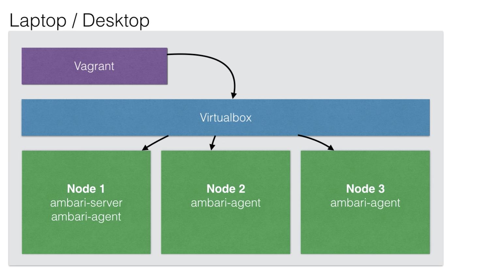

# Vagrant

Every command listed below is supposed to be run from within the folder where this README.md file resides.

The following virtual infrastructure will be provisioned using Vagrant



Install the Vagrant's hostmanager plugin 

```console
$ vagrant plugin install vagrant-hostmanager
```

Install the Vagrant's vbguest plugin 

```console
$ vagrant plugin install vagrant-vbguest
```

Before starting the provisioning, go to **scripts** folder and open the file **create_cluster.sh**. Here, decomment the cluster topology you wan to install.

When ready, provision the cluster:

```console
$ vagrant up
```

Looking at the standard output you may spot some weird red messages. This is normal, just wait for the Vagrant procedure to fisnish.

As soon as the procedure finishes to setup the VMs, point your browser to http://192.168.199.2:8080 or http://localhost:8080 (the port 8080 has been forwarded from your host machine to the node1)

The default login and password are **admin/admin**

Even when Vagrant finishes to provision the VMs, Ambari is still installing and starting packages on the cluster, the entire procedure may take up to 1 hour to complete, so be patient.

At the end of the provisioning process, the following architecture will be available.


