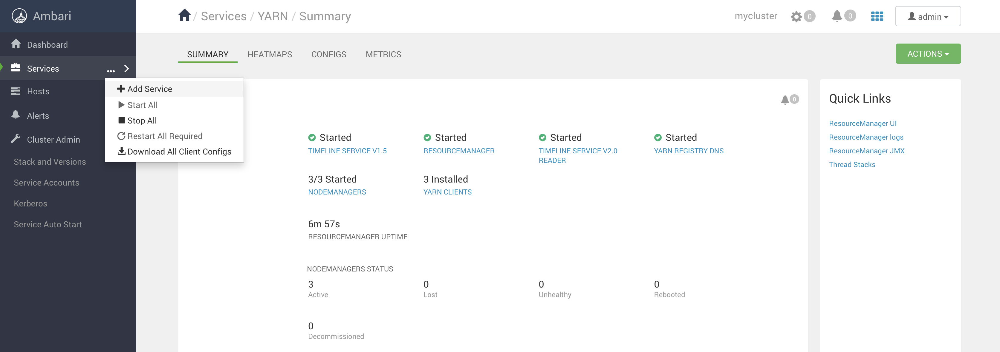
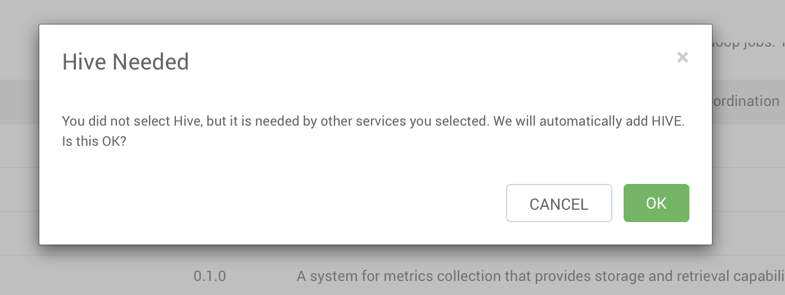
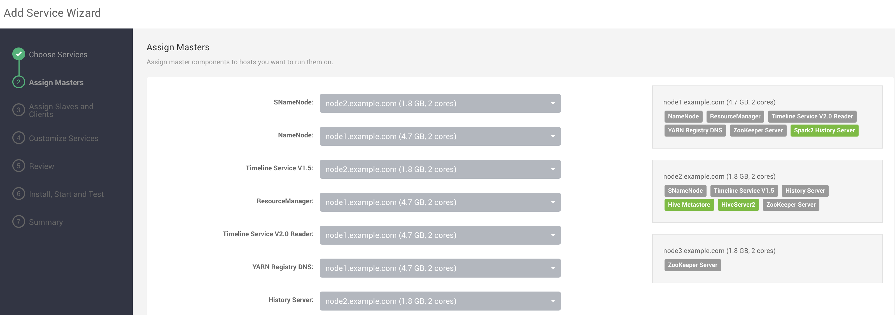
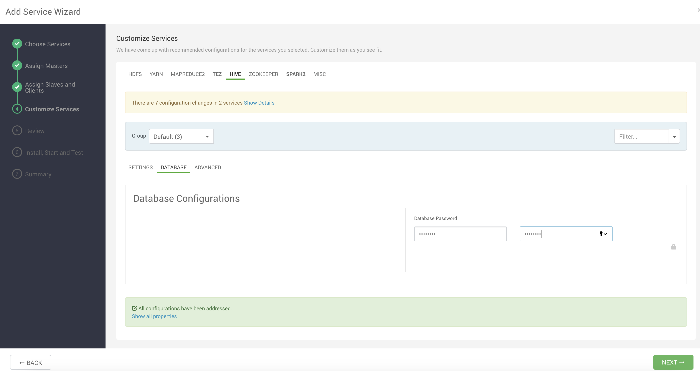

# Spark installation

This lab is intended to guide you installing Spark on a previously set-up Ambari cluster

## Prerequisites

- Having completed the lab [02 - Provision the environment](../02-Provision_the_environment/README.md)
- MySQL JDBC driver must be setup on the node where Ambari server runs

If you have't installed MySQL JDBC driver on the Ambari server node, just jump on it and type:

```
$ sudo yum install mysql-connector-java -y
```

Then, let Ambari know about it 

```
$ sudo ambari-server setup --jdbc-db=mysql --jdbc-driver=/usr/share/java/mysql-connector-java.jar
```


## Install Spark

After having logged in into Ambari using the web UI, follow the visual instructions listed below:










The restart all the components according to the message you get after the Spark installation