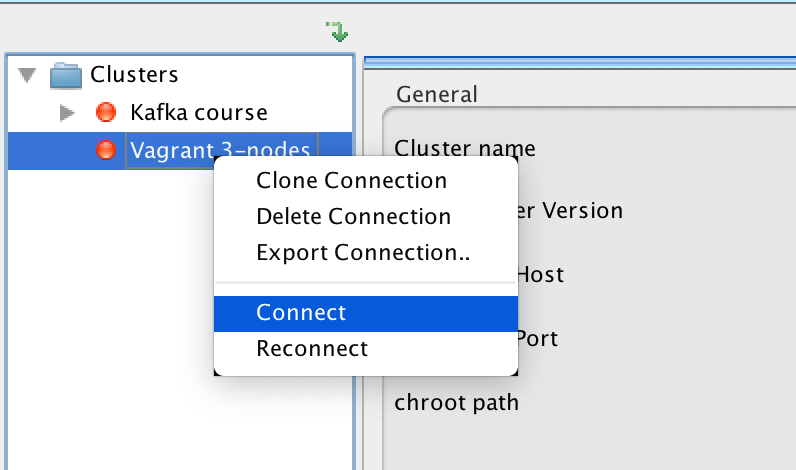
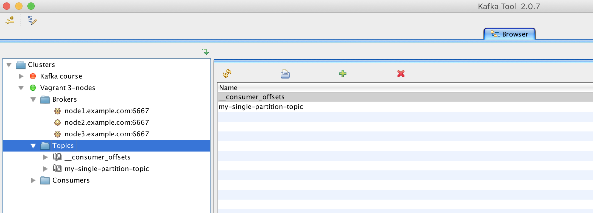
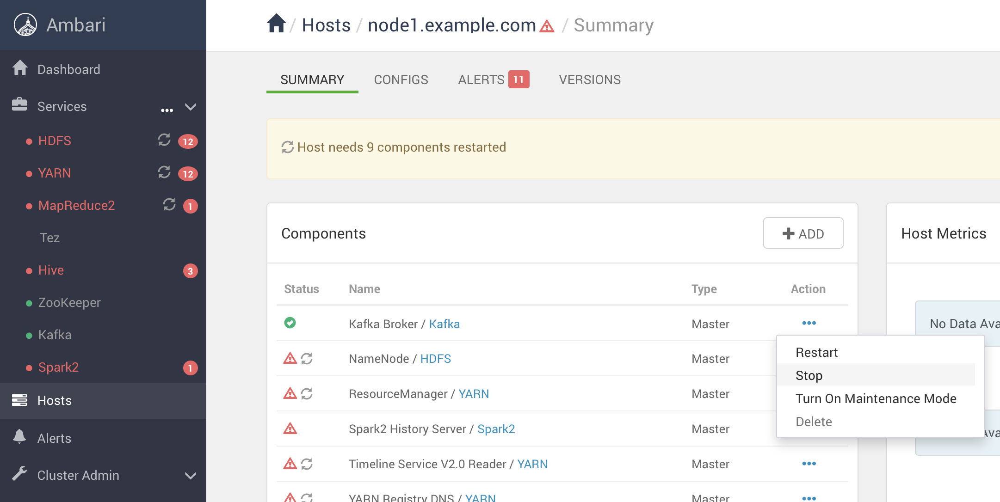

# Kafka partition replication

## Prerequisites

- Having provisioned the Vagrant 3 nodes [Ambari cluster](../02-Provision_the_environment/Vagrant/README.md) Ambari cluster
- Kafka and Zookeeper processes must be started using Ambari on all hosts

Open two terminals on node1 and node2 VMs. The following commands will report in the shell prompt which VM must be run from.

## Kafka Tool software installation

Kafka Tool is a 3rd party software useful to inspect a Kafka cluster using a Grafical User Interface.

Install Kafka Tool for your operating system by downloading it [here](https://www.kafkatool.com/download.html)

Mac users can benefit from Homebrew package manager to have it installed typing the command:

```
$  brew install kafka-tool
==> Downloading https://www.kafkatool.com/download2/kafkatool.dmg
######################################################################## 100.0%
==> Verifying SHA-256 checksum for Cask 'kafka-tool'.
==> Installing Cask kafka-tool
==> Running installer script 'Kafka Tool 2.app/Contents/MacOS/JavaApplicationStub'
```

## Kafka Tool configuration

Open Kafka Tool.

After having started both Zookeeper and Kafka using the Ambari GUI, configure Kafka Tool to connect to the cluster. 

In the left section, right-click on **Clusters** and select **Add new connection**


The connection editor opens. Fill the connection properties tab with with the followings:


In the **Zookeper Host** textfield, you set the IP address of one of the three VM where Zookpeer is running (192.168.199.2 is the node1 VM).

When finished, right-click on the newly created connection and select **Connect**



Kafka Tool connects to Zookeeper to retrive the Kafka cluster information.


You should see the three boker instances in the **Brokers** section.

## Single partition, non-replicated topic

Create a topic with a single partition.

```console
[vagrant@node1 ~]$ /usr/hdp/3.1.0.0-78/kafka/bin/kafka-topics.sh \
    --create \
    --topic my-single-partition-topic \
    --zookeeper node1.example.com:2181,node2.example.com:2181,node3.example.com:2181 \
    --partitions 1 \
    --replication-factor 1
Created topic "my-single-partition-topic".
```

In Kafka Tool, if you expand the **Topics** section you see the newly created topic (you may have to refresh the panel by clicking on the refresh icon on the top if the topic is not showed when you open the section the first time).



From Kafka Tool, if you select the topic you can see that it has a single partition (id 0) and the broker on node1 is its leader (this can be different on your installation since the leader of a topic partition is elected by the cluster at runtime).


You get the same information using the Kafka's command line utilities

```console
[vagrant@node1 ~]$ /usr/hdp/3.1.0.0-78/kafka/bin/kafka-topics.sh \
    --describe \
    --topic my-single-partition-topic \
    --zookeeper node1.example.com:2181,node2.example.com:2181,node3.example.com:2181
Topic:my-single-partition-topic PartitionCount:1        ReplicationFactor:1     Configs:
        Topic: my-single-partition-topic        Partition: 0    Leader: 1001    Replicas: 1001  Isr: 1001
```

This topic is not partitioned nor replicated, what happens if the current partition leader goes down? We try this scenario by shutting down Kafka on the current partition leader:



After having stopped the Kafka partition leader, you can see now that the following command returns "Leader: -1" for the topic **my-single-partition-topic**

```console
[vagrant@node1 ~]$ /usr/hdp/3.1.0.0-78/kafka/bin/kafka-topics.sh \
    --describe \
    --topic my-single-partition-topic \
    --zookeeper node1.example.com:2181,node2.example.com:2181,node3.example.com:2181
Topic:my-single-partition-topic PartitionCount:1        ReplicationFactor:1     Configs:
        Topic: my-single-partition-topic        Partition: 0    Leader: -1      Replicas: 1001  Isr: 1001
```

If you try sending message to this topic you get

```console
[vagrant@node1 ~]$ /usr/hdp/3.1.0.0-78/kafka/bin/kafka-console-producer.sh \
    --topic my-single-partition-topic \
    --broker-list node1.example.com:6667,node2.example.com:6667,node3.example.com:6667
>ciao
[2020-11-19 22:56:23,445] WARN [Producer clientId=console-producer] Connection to node -1 could not be established. Broker may not be available. (org.apache.kafka.clients.NetworkClient)
[2020-11-19 22:56:23,485] WARN [Producer clientId=console-producer] 1 partitions have leader brokers without a matching listener, including [my-single-partition-topic-0] (org.apache.kafka.clients.NetworkClient)
...
^C
```

The message could not be delivered since the partition 0 leader was down. 

Restart the broker just stopped


From Kafka Tool you confirm that the previous message was not delivered from the **Data** tab
s


What we tested is:

- 3 nodes kafka + zookeeper
- topic not replicated
- min.insync.replicas = 1 (default, leader only)
- All the nodes MUST be available at a time
- ack = 1 (default, leader only)

In this scenario we proved that a non replicated partition lead to an inconsistent cluster in the case of a fault of the leader broker.

## Single partition, replicated topic

Create a single partition, replicated topic.

```console
[vagrant@node1 ~]$ /usr/hdp/3.1.0.0-78/kafka/bin/kafka-topics.sh \
    --create \
    --topic my-single-partition-replicated-topic \
    --zookeeper node1.example.com:2181,node2.example.com:2181,node3.example.com:2181 \
    --partitions 1 \
    --replication-factor 3
Created topic "my-single-partition-replicated-topic".
```

Describe the newly created topic

```console
[vagrant@node1 ~]$ /usr/hdp/3.1.0.0-78/kafka/bin/kafka-topics.sh \
    --describe \
    --topic my-single-partition-replicated-topic \
    --zookeeper node1.example.com:2181,node2.example.com:2181,node3.example.com:2181
Topic:my-single-partition-replicated-topic      PartitionCount:1        ReplicationFactor:3     Configs:
        Topic: my-single-partition-replicated-topic     Partition: 0    Leader: 1002    Replicas: 1002,1003,1001        Isr: 1002,1003,1001
```

You now see that this topic has a single partition but with **ReplicationFactor** equals to 3 and the leader is broker 1002 (the one on node3).

```console
[vagrant@node1 ~]$ /usr/hdp/3.1.0.0-78/kafka/bin/kafka-topics.sh \
    --alter \
    --config min.insync.replicas=2 \
    --topic my-single-partition-replicated-topic \
    --zookeeper node1.example.com:2181,node2.example.com:2181,node3.example.com:2181
WARNING: Altering topic configuration from this script has been deprecated and may be removed in future releases.
Going forward, please use kafka-configs.sh for this functionality
Updated config for topic "my-single-partition-replicated-topic".
```

Describe the topic once again:

```console
[vagrant@node1 ~]$ /usr/hdp/3.1.0.0-78/kafka/bin/kafka-topics.sh \
    --describe \
    --topic my-single-partition-replicated-topic \
    --zookeeper node1.example.com:2181,node2.example.com:2181,node3.example.com:2181
Topic:my-single-partition-replicated-topic      PartitionCount:1        ReplicationFactor:3     Configs:min.insync.replicas=2
        Topic: my-single-partition-replicated-topic     Partition: 0    Leader: 1002    Replicas: 1002,1003,1001        Isr: 1002,1003,1001 
```

The min.insync.replicas topic configuration appears in the output.

Start producing messages to this topic

```console
[vagrant@node1 ~]$ /usr/hdp/3.1.0.0-78/kafka/bin/kafka-console-producer.sh \
    --request-required-acks all \
    --topic my-single-partition-replicated-topic \
    --broker-list node1.example.com:6667,node2.example.com:6667,node3.example.com:6667
>message 1
>message 2
>message 3
^C
[vagrant@node1 ~]$ 
````

By opening a new terminal, start consuming messages:

```console
[vagrant@node2 ~]$ /usr/hdp/3.1.0.0-78/kafka/bin/kafka-console-consumer.sh \
    --topic my-single-partition-replicated-topic \
    --from-beginning \
    --bootstrap-server node1.example.com:6667
message 1
message 2
message 3
```

Messages were consumed correctly.

What happens if we shutdown the partition leader?


```console
[vagrant@node1 ~]$ /usr/hdp/3.1.0.0-78/kafka/bin/kafka-topics.sh \
    --describe \
    --topic my-single-partition-replicated-topic \
    --zookeeper node1.example.com:2181,node2.example.com:2181,node3.example.com:2181
Topic:my-single-partition-replicated-topic      PartitionCount:1        ReplicationFactor:3     Configs:min.insync.replicas=2
        Topic: my-single-partition-replicated-topic     Partition: 0    Leader: 1003    Replicas: 1002,1003,1001        Isr: 1003,1001
```

The leader has changed (1003) and the old one disappeared from the the in-sync replicas (Isr: 1003,1001).

If we produce a message:

```console
[vagrant@node1 ~]$ /usr/hdp/3.1.0.0-78/kafka/bin/kafka-console-producer.sh \
    --request-required-acks all \
    --topic my-single-partition-replicated-topic \
    --broker-list node1.example.com:6667,node2.example.com:6667,node3.example.com:6667
[2020-11-19 23:33:04,851] WARN [Producer clientId=console-producer] Connection to node -3 could not be established. Broker may not be available. (org.apache.kafka.clients.NetworkClient)
>message 4
^C
[vagrant@node1 ~]$ 
````

The message still reached the consumer:

```console
[vagrant@node1 ~]$ /usr/hdp/3.1.0.0-78/kafka/bin/kafka-console-consumer.sh \
    --topic my-single-partition-replicated-topic \
    --from-beginning \
    --bootstrap-server node1.example.com:6667
message 4
```

What if we start all the brokers?


```console
[vagrant@node1 ~]$ /usr/hdp/3.1.0.0-78/kafka/bin/kafka-topics.sh \
    --describe \
    --topic my-single-partition-replicated-topic \
    --zookeeper node1.example.com:2181,node2.example.com:2181,node3.example.com:2181
Topic:my-single-partition-replicated-topic      PartitionCount:1        ReplicationFactor:3     Configs:min.insync.replicas=2
        Topic: my-single-partition-replicated-topic     Partition: 0    Leader: 1003    Replicas: 1002,1003,1001        Isr: 1003,1001,1002
```

The new leader remains but now all the brokers are "in-sync" (the one we shutted down before just received a copy of the message we sent when it was shut down).


Improvement:

- replicate partition using replication factor = 3
- min.insync.replicas = 2
- produce messages with ack = all (referred to min.insync.replicas)
- with a 3 nodes kafka cluster, at least 2 nodes MUST be available at a time
- by upgrading the number of kafka nodes to 5 you can shutdown up to 2 nodes in the cluster

